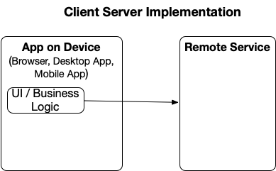
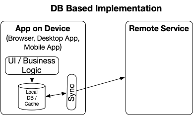
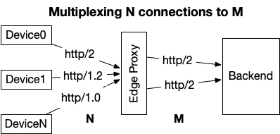

Autocomplete and Typeahead are two common names for a very specific form of what I'd call "contextual search implicitly triggered by interactions". The general problem definition can be stated as something like:

Given a context and user
When that user enters in some text
Then the UI should attempt to predict what that user would type next

It's the cyborg equivalent of someone completing your sentences / thoughts for you.

Some common use-cases for this include:

* Phone text editors suggesting the rest of the word you're typing
* Autocomplete lists in search UIs
* Chat software's @user and #hashtag drop-downs
* Google's search input box
* Gmail attempting to auto-complete your sentences (or in some cases your entire email)

While those are loosely similar interaction patterns, they have very different technical considerations. Some considerations around these are discussed below.

## Chat Software @user and #hashtag completes

These days, every chat program out there allows you to directly ping specific individuals (or bots) by entering in @ followed by some characters. Depending on the type of software, and the scope this can be implemented very differently.

The first consideration is understanding the architecture of the chat software itself. The Software Engineering Daily podcast has [an episode on Facebook Messenger](https://softwareengineeringdaily.com/2020/03/31/facebook-messenger-engineering-with-mohsen-agsen/), discussing some of the ways a modern chat client is implemented. The main summary is modern chat software architecture is not a simple client-server interaction (which would've been my naive assumption previously), but is much closer to an App interacting with a Local DB than a simple client-server architecture.



In particular, in these chat apps, for performance and off-line usage reasons, most of the interactions are App <-> Local DB (possibly SQLite) and then LocalDB <--synchronizer--> Remote Server.



Those two different architectures could handle autocomplete very differently. If you assumed the client has all the user information already, then autocomplete is a client-side feature and the server side part is related to the data synchronization.

However, that may not be a valid assumption, and not all clients would be _that_ smart/rich. Additionally, there may be use-cases where managing the entire dataset constantly is computationally/memory/generally expensive. For example, some chat software hides full user lists in large rooms or organizations.

## Client-server architecture
Given a relatively dumb client, most of the logic around the autocomplete would happen on the server. However, there's still a vast variety of things involved in this interaction. That includes:

* deciding on what the user experience will be on the client(s). This generally lays out the data and method requirements on the server
* how the client interacts with the service from the networking stack, including things like communication mechanism (likely TCP), protocols (likely HTTPS, maybe Protobuf&TLS), connection scheme (persistent connections, one-shot calls, web sockets). This is likely not something you'd specifically do for this interaction, but share across the entirety of the client.
* the general interactions around the API itself, including how you authenticate, client id specification
* the API contract, including the definition of the inputs/outputs/method. This could be as simple as GET https://<domain>/clientSpecificEndpoint?params or something more sophisticated like a GraphQL query. Again, existing system design patterns likely set the standards here, but there's a variety of options available.
* how to implement the backend which implements the actual searching

Though there's a vast variety of answers to each of those, there's likely some commonalities to most production-grade solutions:

* you're probably going to use some variant of HTTPS, using whatever variant of HTTP/1 or HTTP/2 that the client system supports
* connection management (persistenct vs one-shot) that the client cares about is likely to be separate from what you do on the backend, due to things like CDNs or DOS mitigation systems standing between you and the client, likely multiplexing multiple a variety of different clients across the connection mechanism you prefer

* the dumber the client (eg a browser), the more likely you are to use simple RESTish protocols (eg GET /something?params)
* the more clients you have (including allowing 3rd party access), the more you'll want to generalize the API and plan for long-term usage (since deprecation is difficult in those cases)
* autocomplete and typeahead likely want a simple prefix search versus complicated search logic. While it may seem like input="mi" could match both "Michelle" and "Aimi", in practice "mi" matching "aimi" is liable to lead to confusion as people try to interpret why it matched that. Similarly fuzzy matches can seem powerful, but may create a confusing UX. Matching on multiple fields, or word boundaries (mi="Hans Mire") likely are reasonable middle grounds.
* the client should throttle its requests. A user doesn't want a UI flapping around every time they type another letter, and a system can quickly get overloaded by N users typing M letters each triggering a search.
* as with most APIs, you likely want this all to be _stateless_. The client may need to track some state (eg tokens for next results), but there's not much reason to use a session for tracking the API.
* the response may want to include information about what triggered the match. Naively if you search for "mi" you could again on the client search through all fields to find "mi", but then the client is guessing at what the server did. That could be returned explicitly.
* some sort of context is likely important for the autocomplete. It might be "what user group is someone sending the message from" or "what chat room am I in". That may be useful for prioritizing the results, or for filtering them

### Case study: Simple customer interaction design

A similar situation where I implemented autocomplete was finding customers who purchased a discount for a merchant. The customer would come to the merchant, state their name, and the merchant could look them up using one of a variety of devices (custom tablet and app, phone app, mobile web clients [smart and dumb]).

For this situation, the clients were all pretty similar (ignoring the dumb web client version) and most of the main decisions were already in place (HTTPS, persistent connections terminating at the edge, OAuth, RESTish/JSON).

The initial definition of the feature implied the feature to be more of a search than an autocomplete. In particular, the spec asked for fuzzy matches and partial matches (eg mi="*mi*"). After initial experimentation, the UX didn't feel right and a pure prefix search across multiple fields (first/last name, purchase identifiers) was decided on.

Given the surrounding architecture this fit into, the general pattern was of the form:

```
GET https://api.something/version/merchants/<merchant_id>/customer_discounts/autocomplete?prefix=mi&limit=10

<Headers including authentication information & client id>

{
  "customerDiscounts": [
    { /*info about customer 1 and some metadata */ },
    ...
  ],
  "nextPage": "<token>"
}
```

Notes on this implementation:

* this explicitly does not allow specifying how the search itself works (eg which fields to use) so as to allow that to be iterated on without client-side changes
* while the authentication identified the user and therefore the merchant generally, in some use-cases the user may operate with multiple merchants simultaneously, so that too was explicitly specified
* the data was implicitly sorted on the backend
* rate limiting was a concern implemented based on the client id
* because an arbitrary number of results could be returned, the results were paginated
* while this was a simple prefix, because the search was against multiple fields, it did include metadata about which fields matched

### Fancy whiz-bang interaction design

If building a more modern, general API solution, possibly being used by externally managed/developed clients, the solution likely would look somewhat different than the above simple finder case.

Starting from scratch, it'd be likely that you'd want to consider:

* using a baseline of persistent connections and HTTPS (HTTP/1.1+ or HTTP/2). Other options are viable as well, but HTTP is ubiquitous and persistent connections would reduce the latency impact of SSL / TCP handshakes on the clients
* there's a plethora of Authentication options and generally auth is too complex to quickly summarize, but OAuth 2 is a good starting point
* for the API itself, REST is still a simple, ubiquitous pattern. GraphQL has a strong following and variety of benefits ([an interview with the creators of Apollo discusses many of them](https://softwareengineeringdaily.com/2020/01/17/apollo-graphql-with-geoff-schmidt/)). In particular GraphQL inherently would give the client more functionality, such as standards for specifying what fields it wants, patterns for supporting pagination, and a growing toolset surrounding it. However, for arbitrary uses, the answer might be "both", including [wrapping your REST api with GraphQL](https://graphql.org/blog/rest-api-graphql-wrapper/).
* a general solution used by a variety of clients implies it will need to be supported for a long period of time. For that, it's worth considering if your autocomplete is a specific feature/endpoint, or just part of a generalized search interface. It may make sense to initially release an autocomplete specific endpoint, and later expand to a generalized solution to avoid [YAGNI](https://martinfowler.com/bliki/Yagni.html) however.

## Backend implementation

There are a large variety of ways to implement the backend for autocomplete, and a huge set of off-the-shelf technologies to enable it. Especially in the cases solvable as prefix searches, the backend doesn't _need_ to be more than a simple Mysql or Postgres query using `WHERE field1 LIKE "<prefix>%" OR field2 LIKE "<prefix>%"`. Assuming proper indexes on those columns, a [LIKE query can be efficient](https://makandracards.com/makandra/12813-performance-analysis-of-mysql-s-fulltext-indexes-and-like-queries-for-full-text-search) and scaled out using read replicas. Other search systems like ElasticSearch too can be leveraged for this use-case (using [prefix](https://www.elastic.co/guide/en/elasticsearch/reference/current/query-dsl-prefix-query.html) or the newer [search-as-you-type](https://www.elastic.co/guide/en/elasticsearch/guide/2.x/_index_time_search_as_you_type.html#_index_time_search_as_you_type) functionality), but this prefix search operation is not truly a generalized search with scoring or fuzzy matching or other complex operations.

If for some reason you do need a custom solution, you'll likely want to explore Tries if you can fit everything in-memory.
